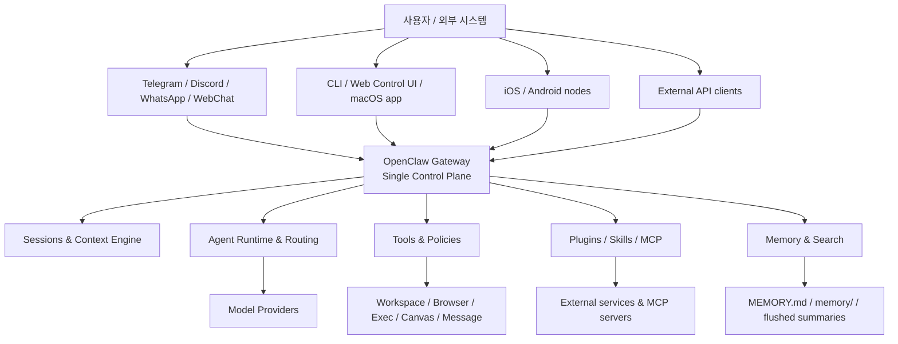

## 🧭 학습 메타

| 항목 | 내용 |
|---|---|
| 현재 단계 | **Core** |
| 읽는 목적 | 이해 이해와 실전 연결 |
| 추천 환경 | Windows WSL2 + Ubuntu 기준, 필요 시 macOS / Linux / Windows Native 비교 |
| 현재 위치 | `concepts/features` |

:::tip 학습 팁
이 문서는 **혼자 읽어도 이해되게** 정리되어 있지만, 처음이면 문서 끝의 **다음 단계** 링크까지 이어서 보는 게 가장 빠릅니다.
:::

# 아키텍처 개요 (Architecture)

이 문서에서는 OpenClaw의 핵심 개념을 쉽게 이해하는 방법을 배웁니다.

## 📌 이 문서에서 배우는 것
- 핵심 관점
- 구조 다이어그램
- 구성요소 설명

걱정하지 마세요, 하나씩 따라하면 됩니다! 😊

OpenClaw 아키텍처를 이해하는 가장 쉬운 방법은 **Gateway (중앙 통로) 중심 구조**로 보는 것입니다. 채널, 앱, node, CLI, API는 모두 Gateway에 붙고, Gateway는 세션·에이전트·도구·정책을 한곳에서 조정합니다.

:::tip 💡 쉽게 이해하기
**Gateway**는 쉽게 말해 "교환대"예요. 여러 앱과 도구, AI 모델 사이를 이어주는 중앙 통로라고 생각하면 이해하기 쉽습니다.
:::

## 핵심 관점

> OpenClaw는 여러 UI가 각각 따로 AI를 부르는 구조가 아니라, **하나의 Gateway를 공유하는 멀티채널 agent platform**입니다.

## 구조 다이어그램

아래 다이어그램을 보면 구조를 한눈에 이해할 수 있습니다:

## 구성요소 설명

### Gateway

모든 진입점이 만나는 **단일 제어면**입니다.

- 채널 연결
- 인증
- 세션 생성/복구
- 에이전트 라우팅
- 도구 노출
- 웹/API/노드 연결

### Sessions & Context Engine

현재 대화와 작업 상태를 유지합니다.

- 메인/그룹 격리
- 최근 히스토리 유지
- compaction
- pruning
- 요약 및 context flush

### Agent Runtime & Routing

사용자의 요청을 어떤 에이전트가 처리할지 결정하고, 필요하면 서브에이전트나 ACP 런타임으로 분기합니다.

### Tools & Policies

실제 행동 계층입니다.

- 파일 읽기/쓰기/편집
- 셸 실행 및 프로세스 관리
- 브라우저 자동화
- 메시지 전송
- Canvas 제어
- 이미지/PDF 처리

이 계층 위에 sandbox mode, tool policy, elevated 경계가 적용됩니다.

### Plugins / Skills / MCP

기능 확장 계층입니다.

- Plugins: 확장 패키지
- Skills: 도구 사용 지침
- MCP: 외부 기능 연결 표준

### Memory & Search

지속 기억 계층입니다.

- `MEMORY.md`
- `memory/` 폴더
- flush된 요약
- 검색 및 회수(retrieval)

## 왜 이 구조가 중요한가

이 아키텍처 덕분에 OpenClaw는 다음을 동시에 만족합니다.

- 채널이 달라도 같은 기억과 세션 철학을 유지
- 도구 호출과 모델 응답을 같은 제어면에서 관리
- 모바일 node와 서버 도구를 한 제품 안에서 연결
- API, UI, 메신저가 모두 같은 런타임을 바라봄

## 관련 문서

- [기능](/concepts/features)
- [에이전트](/concepts/agent)
- [컨텍스트](/concepts/context)
- [게이트웨이 개요](/gateway/)

## 🎯 다음 단계

- 다음으로 [기능](/concepts/features) 문서를 읽어보세요.
- 다음으로 [에이전트](/concepts/agent) 문서를 읽어보세요.
- 다음으로 [컨텍스트](/concepts/context) 문서를 읽어보세요.
